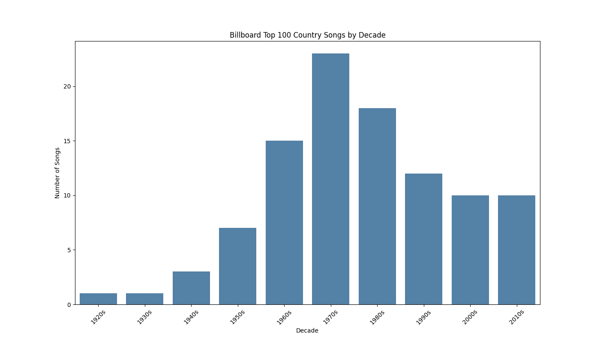
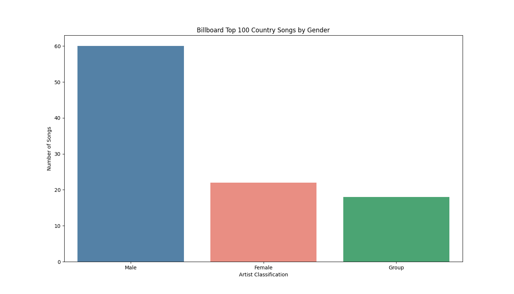
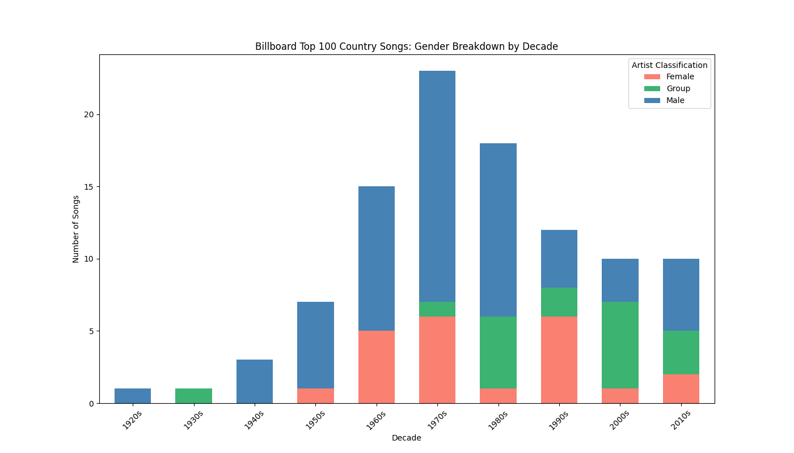

# Billboard Top 100 Country Songs Analysis

## Executive Summary

This project analyzes Billboard's Top 100 Country Songs of All Time by building a data pipeline that scrapes song and artist data from Billboard, adds contextual data through the addition of each song's release year from the Genius API, classifies artists by gender, and visualizes the results across three charts.

The pipeline produces:
- A cleaned dataset of 100 songs with artist, rank, release year, gender classification, and decade
- Three visualizations showing how the list breaks down by decade and artist gender

The resulting analysis reveals clear patterns in how country music's most recognized songs are distributed historically and demographically.

---

## Key Takeaways

- The 1970s produced the most top 100 country songs with 23, followed by the 1980s with 18. Billboard's list likely is biased towards eras that the compilers are more personally familiar with
- Male artists account for 60% of the list, female artists for 22%, and groups for 18%, reflecting country music's historically male-dominated landscape
- Female representation on the list is essentially absent before the 1960s, peaks in the 1970s, and declines in recent decades
- Group representation grows significantly through the 1980s and 1990s before tapering in the 2000s and 2010s
- The gender breakdown by decade chart marks a visible shift in recognition as the genre evolves over time

---

## Final Visualizations





---

## Requirements

```
playwright
pandas
numpy
requests
gender-guesser
matplotlib
seaborn
```

Install Playwright browsers after installing the package:

```
playwright install
```

---

## Methodology

### Problem Framing

The goal of this project was to answer three questions about Billboard's Top 100 Country Songs of All Time:

1. Which decade produced the most top 100 country songs?
2. What is the overall distribution of songs by male, female, and group artists?
3. How did that gender and group distribution change decade by decade?

To answer these questions a full data pipeline was built in the following stages:

### Pipeline

- **Sources**: Data collected directly from Billboard's website and the Genius API
- **Cleaning**: Regex patterns handle formatting artifacts in scraped text before any analysis runs
- **Validation**: Missing values, unknown classifications, and API failures are checked at each stage

### Inputs Used

- Billboard page HTML (scraped via Playwright)
- Genius API search endpoint (song ID lookup)
- Genius API song detail endpoint (release date retrieval)
- gender-guesser library (first name gender inference)
- Manual corrections for 2 missing release years, 1 song title, and 8 gender classifications

---

## 1. Web Scraping with Playwright

Billboard dynamically loads content, which means a standard `requests` call returns an empty page with no song data. Playwright resolves this by launching a real browser instance, waiting for a fully rendered page, and then executing the scrape.

Billboard also employs bot detection that caused the page to time out when accessed by an automated browser. A custom user agent header was passed through the browser context to mimic a standard Chrome browser on macOS (created with Gemini AI), and the page timeout was extended to 60 seconds to account for slower loads under these conditions.

The scraper locates each song entry using a CSS class selector targeting the slide wrapper elements, extracts the `h2` title element from each slide, and splits the text on the comma delimiter that separates artist from song title. Each result is stored as a one-row DataFrame, appended to a list, and concatenated into a single DataFrame at the end of the loop.

---

## 2. Data Cleaning

After scraping, both artist and song strings required significant cleaning before they could be used for API queries or analysis. Billboard titles contain several consistent formatting artifacts:

- Newline and tab characters embedded in the text
- Featured artist credits appended to the artist name
- Bracketed annotations on song titles
- Inconsistent leading, trailing, and internal whitespace

These were removed using a series of `str.replace()` calls with regex patterns. Whitespace was stripped from both ends and internal runs of multiple spaces were collapsed to a single space.

Search queries for the Genius API were then built from the cleaned fields by lowercasing both strings, replacing spaces with URL-encoded `%20` characters, joining artist and song into a single query string, and replacing ampersands that would break the URL format.

---

## 3. Release Year Retrieval with Genius API

Release years are not available on the Billboard page, so a two-step Genius API lookup was used to retrieve them for each song.

The first call queries the Genius search endpoint using the formatted query string to retrieve the top matching result and extract its song ID. The second call hits the Genius song detail endpoint using that ID to retrieve the full song metadata including release date.

The release date field on Genius is inconsistently structured across songs. Some entries return a full formatted date string, some return a structured dictionary of date components, and some return nothing at all. The function handles all three cases:

- A regex pattern extracts a four-digit year matching `19XX` or `20XX` from a full date string
- The `release_date_components` dictionary is used as a fallback if no date string is present
- `None` is returned if both lookups fail, allowing the row to be flagged and corrected manually

A random sleep between 0.1 and 0.5 seconds was added between each API call to stay within rate limits. Two songs returned no year from either method and were corrected manually after inspecting the missing values.

---

## 4. Manual Corrections

Three categories of manual corrections were applied after the automated pipeline ran:

**Missing release years** — Two songs (ranks 15 and 68) returned no year from the Genius API and were filled in manually after looking up the correct release dates.

**Song title correction** — Tom T. Hall's entry was returned by the scraper without its full title. The correct title "(Old Dogs, Children and) Watermelon Wine" was applied manually using a targeted `loc` override.

**Gender classification overrides** — Eight artists returned "unknown" from the gender-guesser library and were corrected manually. Corrections included Skeeter Davis (Female), Emmylou Harris (Female), Alabama (Group), Old Crow Medicine Show (Group), DeFord Bailey (Male), Lady A (Group), Webb Pierce (Male), and Lefty Frizzell (Male).

---

## 5. Gender Classification

Artist gender was classified using the gender-guesser library, which infers gender probabilities from first names using a large name database. Before passing any artist to the detector, a keyword check screens for groups and duos. Artists whose names contain terms like `Band`, `Chicks`, `Judds`, `Flatts`, `&`, or `and` are classified as Group automatically for a more streamlined process, bypassing the name-based inference entirely.

For artists that pass the keyword check, the first word of the artist name is extracted and passed to the detector. Results of `male` or `mostly_male` are mapped to Male, `female` or `mostly_female` to Female, and anything else to Unknown for manual review.

---

## 6. Visualizations

Three charts were produced using matplotlib and seaborn.

**Songs by Decade** — a bar chart showing the count of top 100 songs by the decade in which they were released. The 1970s dominate with 23 songs, followed by the 1980s with 18. The drop-off in the 2000s and 2010s suggests Billboard's list is heavily weighted toward an older country era, likely a period the compilers of this list have personal experience with.

**Songs by Gender** — a bar chart showing the overall breakdown across the full list. Male artists account for 60 songs, female artists for 22, and groups for 18. The gap between male and female representation reflects country music's historically male-dominated industry structure.

**Gender Breakdown by Decade** — a stacked bar chart that combines both dimensions. Female representation is essentially absent before the 1960s and peaks in the 1970s before declining. Group representation grows steadily through the 1980s and 1990s. This chart shows how the makeup of the list shifts depending on the era.

---

## Usage

Add your Genius API token to the script where indicated before running:

```python
secret = 'YOUR_GENIUS_API_TOKEN_HERE'
```

Then run the script from the terminal:

```
python3 CountryScript2026.py
```

The script will open a browser window to scrape Billboard, then run the full pipeline automatically. Three chart images and the final dataset will be saved to the working directory:

- `songs_by_decade.png`
- `songs_by_gender.png`
- `gender_by_decade.png`
- `billboard_with_years.csv`
